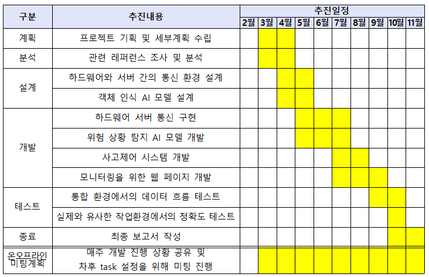
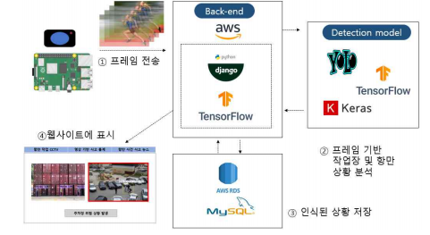
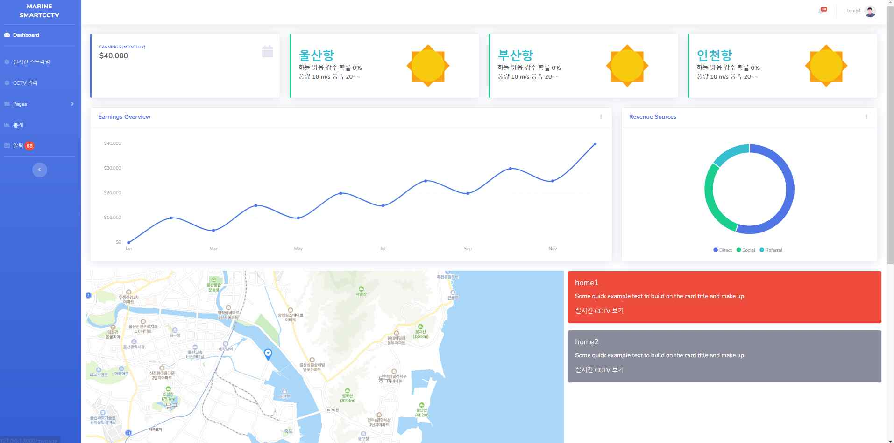

# 2023_Port_Safety_Management_System

### 🚢 2023 스마트 해상물류 X ICT 멘토링 프로젝트 공모전을 위한 Repository 입니다.   

⏺️ **주요 기능**
-   CCTV를 통해 위험 구역 영상 획득 
-   AI 영상 분석을 통해 위험 구역 내의 객체 분석 판단, 위험 감지 및 예측
-   항만 관리자의 모니터링 및 상호작용을 위한 웹 페이지 구현

⏺️ **개발 기간** : 2023.04 ~ 2023.11  

⏺️ **개발 인원** : 4명 (팀 프로젝트)   

⏺️ **시연 영상** : ----- 결과물 유튜브 링크 ----

 

## 🖥️ 개발 환경
|종류|환경|
|--|--|
|언어|Python|
|프레임워크| |
|서버|Amazon 
|DB|MySQL 8.0, Amazon RDS|
|IDE 및 Tool|IntelliJ IDEA, Visual Studio Code, MySQL Workbench|
|API 및 라이브러리| |

 

<!--
## 🤖 담당 역할
|담당|내용|
|:--:|--|
|윤동근 (Network)|   |
|이승현 (HardWare)|   |
|이지원 (AI, DB, WEB)| (참고를 위해 넣은 프론트엔트 예시) 화면 디자인 및 퍼블리싱(채팅 , 게시글 작성, 마이페이지) Socket을 활용한 채팅 기능 카카오 맵 API를 활용한 지도, 주소데이터 처리 Vuex를 통한 상태 관리 Vue.js 기반의 컴포넌트 구성, Axois를 이용한 비동기 통신 |
|전영민 (AI)|   |

 

## 📆 프로젝트 수행 일정 (추후에 실제 진행했던 일정대로 표 수정 필요)

 

## 📰 Schema (예시)

 

## 📊 구성도 (예시)

 

## 🏆 결과물 (예시)
   
-->
